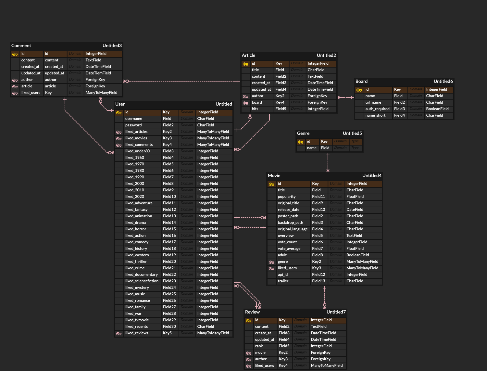

---

# SCAFY

> SSAFY Cinema Analysis For You

SSAFY 3기 1학기 최종 프로젝트로 제작한 영화 리뷰 커뮤니티 입니다.

## 개요

### 1. 팀명

SCAFY는 SSAFY Cinema Analysis For You의 약자로 사용자 취향으로 영화를 추천해 주는 서비스를 만들고자 하는 팀의 목표가 담긴 이름입니다.

### 2. 사용한 프레임워크, 라이브러리

        

#### [Django](https://docs.djangoproject.com/en/3.0/)

#### [Bootstrap](https://getbootstrap.com/)

#### [W3.CSS](https://www.w3schools.com/w3css/default.asp)

#### [TMDb API](https://developers.themoviedb.org/3/getting-started/introduction)

#### [GoogleFonts](https://fonts.google.com/)

#### [jQuery](https://jquery.com/)

#### [Fontawesome](https://fontawesome.com/)

### 3. 개발 일정

| 6월 11일                                                     | 6월 12일                                             | 6월 13일                                                     | 6월 14일                                                     |
| :----------------------------------------------------------- | :--------------------------------------------------- | :----------------------------------------------------------- | :----------------------------------------------------------- |
| 모델링 URL 설계 앱 별 view, template 틀 잡기 side navigation bar 틀 잡기 tmdb api를 이용한 데이터 수집 | 게시판 세부기능 구현 영화목록 페이지, 기능 구현 | 추천 알고리즘에 사용할 데이터 모델링 리뷰 별점 스타일링 영화 목록 정렬기능 추가 프로필 페이지 구현 | 전체적인 화면 디자인 구현 추천 알고리즘 구현 편의기능 추가 영화평점 업데이트 기능 추가 |

| 6월 15일                                                     | 6월 16일                                                     |           6월 17일           | 6월 18일                         |
| :----------------------------------------------------------- | :----------------------------------------------------------- | :--------------------------: | :------------------------------- |
| 게시판 편의기능 추가 영화검색기능 추가 예고편 버튼 스타일링 서비스 전체 디자인 컨셉 변경 | 편의성 기능 추가, 디자인 변경  - 정렬기준 강조 - 로그인 경고창,  - 프로필 영화 제목 추가 - 메인페이지 영화 디자인) 서비스 디자인 컨셉 변경 오류 보완 | 오류 보완 발표자료 작성 | 오류보완 [배포](#4-배포-url) |

### 4. 업무 분담

**공통**

- 오류 보완
- 디자인 수정

**이종우** 

- Django View, Model
- 데이터 수집

**김지영** 

- Django Template
- Javascript
- 서비스 디자인

## 내용

### 1. ERD

### 2. 필수 구현 기능

#### 관리자 뷰

- 관리자 권한의 유저만 영화 등록 / 수정 / 삭제 권한을 가집니다. 

- 관리자 권한의 유저만 유저 관리 권한을 가집니다.

#### 영화 정보

- 영화 정보는 Database Seeding을 활용해 최소 50개 이상의 데이터가 존재하도록 구성해야 합니다. 
- 모든 로그인 된 유저는 영화에 대한 평점 등록 / 수정 / 삭제 등을 할 수 있어야 합니다. 

#### 추천 알고리즘

- 평점을 등록한 유저는 해당 정보를 기반으로 영화를 추천받을 수 있어야 합니다. 
- 사용자는 반드시 최소 1개 이상의 방식으로 영화를 추천받을 수 있어야 합니다.
  - 최근 좋아요 한 영화 기반 추천방식
  - 내가 좋아요 한 영화의 장르 기준 추천
  - 내가 좋아요 한 영화와 비슷한 제목의 영화 추천
  - 영화 공개일 기준 최신 영화 추천
  - 전체 영화 랜덤 추천
- 어떤 방식으로 추천 시스템을 구성했는지 설명할 수 있어야 합니다.

#### 커뮤니티

- 영화 정보와 관련된 대화를 할 수 있는 커뮤니티 기능을 구현해야 합니다.

- 로그인한 사용자만 글을 조회 / 생성 할 수 있으며 작성자 본인만 댓글을 삭제할 수 있습니다.

- 사용자는 작성된 게시글에 댓글을 작성할 수 있어야 하며 작성자 본인만 댓글을 삭제할 수 있습니다.

- 각 게시글 및 댓글을 생성 및 수정 시각 정보가 포함되어야 합니다.

  

#### 기타

- 최소한 5개 이상의 URL 및 페이지를 구성해야 합니다.
- HTTP Method와 상태 코드는 상황에 맞게 적절하게 반환되어야 하며, 필요에 따라 메시지 프레임워크 등을 사용하여 에러 페이지를 구성해야 합니다.
- 필요한 경우 Ajax를 활용한 비동기 요청을 통해 사용자 경험을 적절하게 향상시켜야 합니다.

### 3. 목표 서비스 / 실제 구현 정도

#### 목표

[2번 항목](#2-필수-구현-기능)

#### 실제 구현 정도

##### 추가 기능

- 게시글 Pagination

- 복수의 기능 게시판 구성

- 게시판 별 접근권한 설정

- 로그인한 사용자는 영화 목록에서 장르, 제목을 기준으로 검색할 수 있습니다.

- 전체 영화 목록에서 평점순, 개봉순으로 정렬할 수 있습니다.

- 관리자 권한의 유저만 공지사항에 글을 작성할 수 있습니다.

- 공지사항에 작성된 글은 게시판 별 가장 상단에 표시됩니다.

  

### 4. 배포 URL

http://3.23.206.76

## 기타

### 느낀 점

수업을 들으면서 미니 프로젝트는 많이 해 봤지만 처음부터 배포까지 팀원과 스스로 해 보게 되어서 재미있었다. 기간을 정해놓고 역할을 나누어서 만드는 과정을 즐기면서 할 수 있었고, 원하는 대로 잘 안될때 해결법을 찾으면서 더 많이 배우는 기회가 되기도 했다.